<h1 align="center">Hey 👋, I'm Shuraj Shampang</h1>
<h3 align="center">aka shurajcodx — Full Stack Engineer • Security & Automation • Open Source</h3>

  <a href="https://surajrai.name.np">🌐 Portfolio</a> •
  <a href="https://twitter.com/shurajcodx_">🐦 Twitter</a> •
  <a href="https://www.youtube.com/@SJDrukYT">🎮 YouTube</a> •
  <a href="https://www.linkedin.com/in/shuraj-shampang-9ab602b5/">💼 LinkedIn</a> •
  <a href="https://app.streamersalert.com/donate/shuraj-shampang">☕ Support Me</a>

🧠 I'm a self-driven software engineer from Nepal 🇳🇵 who enjoys building products that solve real-world problems through **AI, automation, security, and developer productivity**.

🔐 **Creator of [EncoraDB](https://www.npmjs.com/org/encoradb)** — an **ORM-agnostic database encryption layer for Node.js & TypeScript**, designed for automatic field-level encryption, KMS integration, and zero schema changes.

🚀 Currently building:

- 🌊 **PravahaOps** — An AI-powered operations platform that brings together CRM, Shared Inbox, Workflow Automation, Reporting, and Team Collaboration into one workspace.
- 🔐 **[EncoraDB](https://github.com/shurajcodx/encoradb)** — ORM-agnostic database encryption for Node.js & TypeScript.
- ⭐ **[android-app-rating-dialog](https://github.com/shurajcodx/android-app-rating-dialog)** — A lightweight, customizable in-app rating dialog for Android.

💡 I enjoy building software that replaces complexity with clarity, whether it's a SaaS platform, an open-source library, or a developer tool.

### 🛠️ Tech Stack

`TypeScript` `JavaScript` `Java` `Kotlin` `PHP` `SQL` `React` `React Native` `Vue.js` `Jetpack Compose` `Node.js` `Fastify` `Express` `Spring Boot` `Laravel`
`PostgreSQL` `Redis` `MongoDB` `MySQL` `MariaDB` `Docker` `BullMQ` `GitHub Actions` `AWS` `Postman` `Jest`

### 📊 GitHub Activity

  

# 💭 Engineering Principles

- 🚀 Build products, not demos.
- 🧩 Keep software simple, maintainable, and scalable.
- 🔐 Security should be built in, not bolted on.
- ✨ Great user experience is a feature.
- 🤖 Automate repetitive work whenever possible.
- 📊 Optimize only when the data proves it's necessary.
- 📚 Never stop learning and improving.

# 🤝 Open Source

Open source has played a significant role in my journey as a developer. I enjoy building tools that help developers write better software and solve real-world problems.

Whether it's creating secure backend libraries like **EncoraDB**, useful Android components, or contributing ideas to the community, I believe sharing knowledge makes the ecosystem stronger.

I'm always happy to receive feedback, collaborate on interesting projects, and connect with fellow developers.

> **"Building software that replaces complexity with clarity."**  
> — **Shurajcodx**
